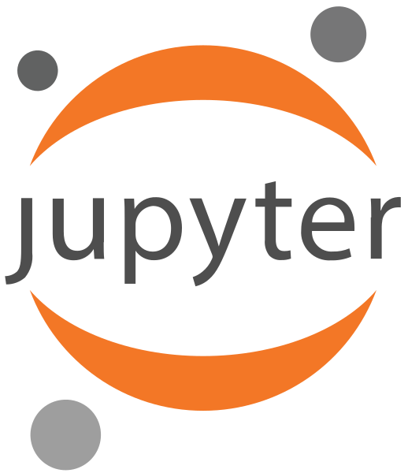
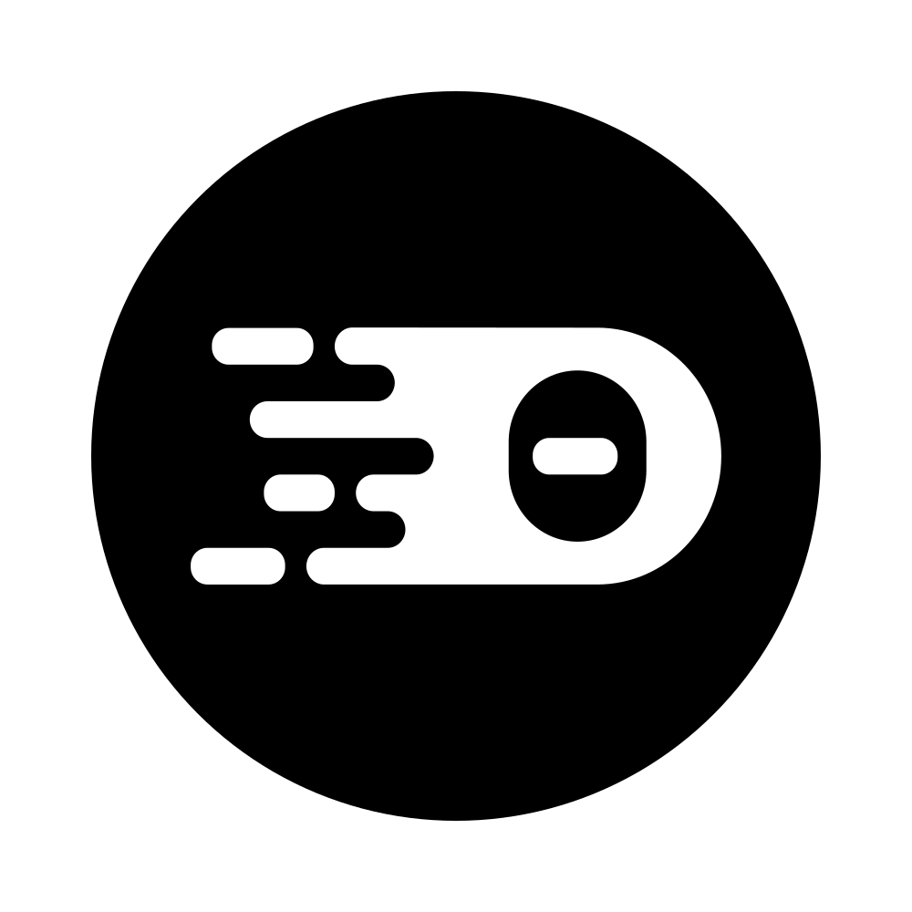

# Processor Development Environment

<table>
<tr>
<td></td>
<td>Interact with code and data - Powered by Jupyter Lab</td>
</tr>
</table>

<table>
<tr>
<td></td>
<td>Develop using an integrated development environment - Powered by Theia</td>
</tr>
</table>

<table>
<tr>
<td></td>
<td>Store - Powered by MinIO</td>
</tr>
</table>

<table>
<tr>
<td></td>
<td>Build - Powered by Jenkins</td>
</tr>
</table>

<table>
<tr>
<td></td>
<td>Build pipeline - Powered by Jenkins Blue Ocean</td>
</tr>
</table>
